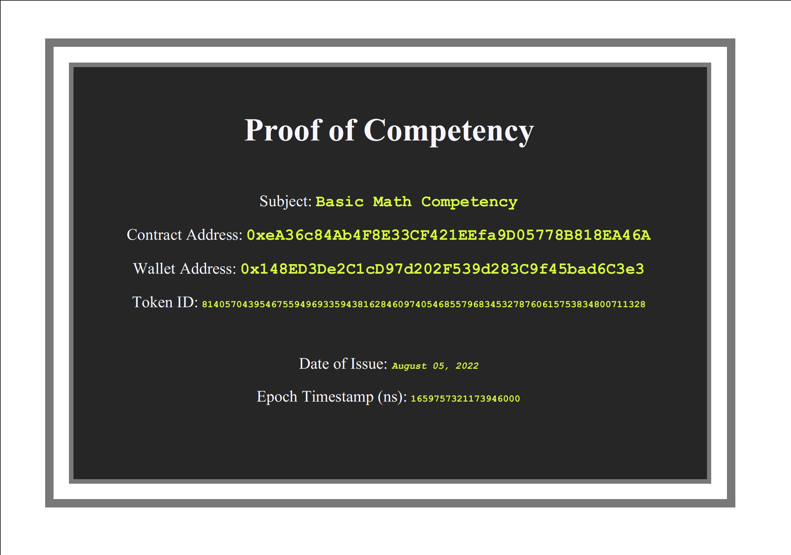
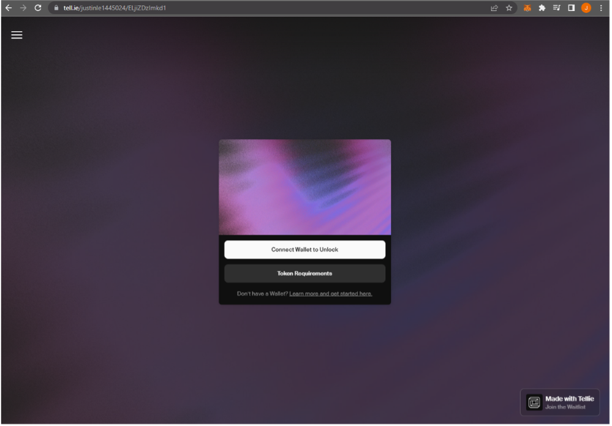
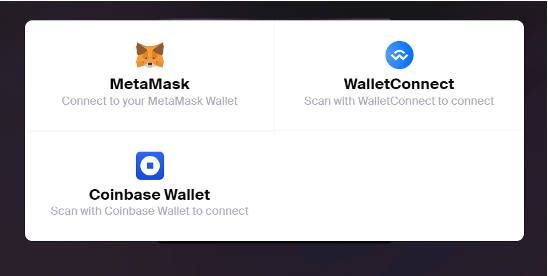
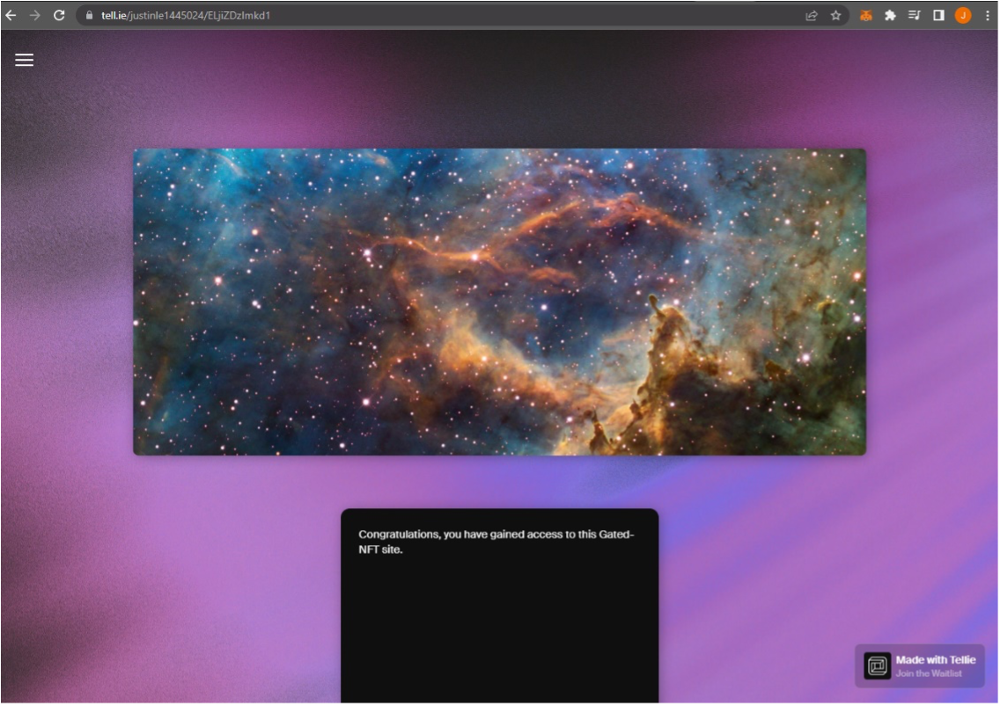
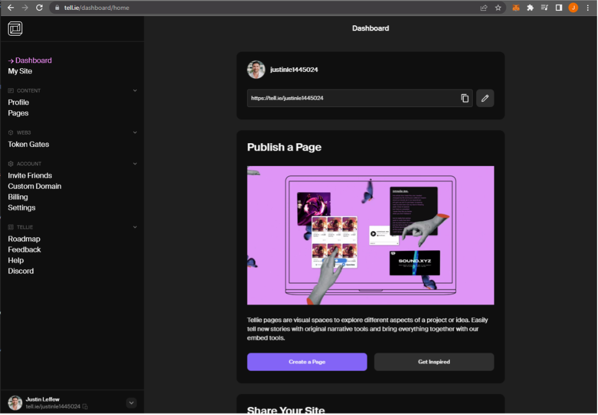
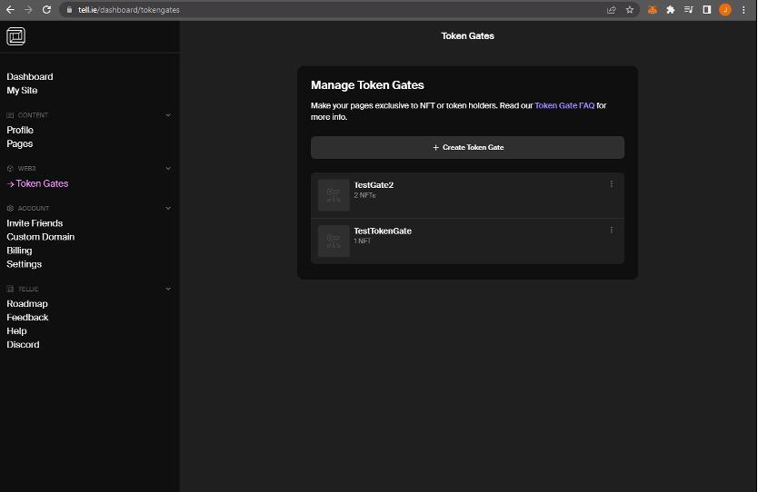
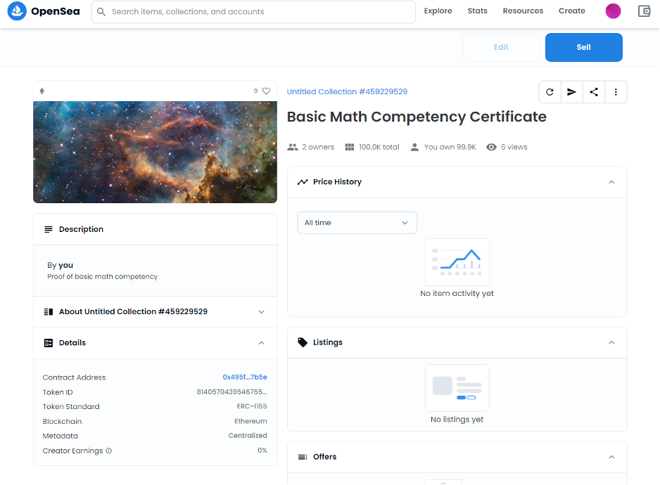
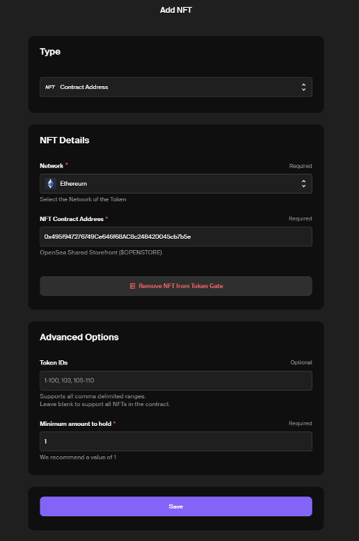

<h3> || <b><i> Project3 </i></b> || </h3> 

# Minting and Printing NFT Certificates: <i>Proof of Competency</i></h1> 

<h3> - <i>A Web3 project by Justin L with Ameira M and Jeff B<i></h3>

---

## Background (*Problem Statement*)

One of the biggest problems in the world today is misinformation and disinformation. Whether it be Twitter, Facebook, TikTok, Truth Social, or any other social media app, everyone can have a voice in the public square. While freedom of speech is the first amendment to the Constitution, it does not say all speech deserves to be heard by everyone. 

## Proof of Concept (*User Story*)

We envision a world where instead of seeing posts and comments from everyone, users can filter them and only see information from those who have verifiable expertise in the subject being discussed. If someone wants to be able to contribute to the public conversation about a certain topic, they must show they have a minimum acquired knowledge. As a proof of concept, once a user passes a test, an ERC721 NFT will be minted and passed to their wallet. This will be a key that will give them access to read & write within a forum. Users without a valid NFT Certificate will have  read-only access. Users can be pseudonymous while also being trusted experts, depending on the number of NFTs. NFTs are tied to public addresses and visible to all.

## Minimimum Viable Product (*MVP*)

A user can submit answers to a short test.

The submission will be checked against an answer key.

If the answers are correct (passing threshold), the user can mint an NFT certificate tied to their address.

The certficate ID will be added to a file.

Certificate IDs in this file can be read for "proof of competency", which grants a user write permissions (boolean).

## Additional Features (*Future / Time Allowing*)

- A forum to read from

	- Write only with valid NFT certificate

- Print/download the NFT as a pdf.

- Image/Design on the pdf (visually catchy)

## Resources

We plan on using the following systems to run our app:

	- Remix
	- Ganache
	- Streamlit
	- tell.ie
	- Ethereum wallet (Metamask, Coinbase Wallet)
	- OpenSea

	- wkhtmltopdf & pdfkit (packages)

## Streamlit (Prove Your Competency)

A lightweight proof of concept where the quiz is taken and the NFT is minted. A pdf is available for download of the certificate (for fun).

## Gated NFT Website Access Readme

We used a no-code/low-code product called Tellie to generate a NFT-gated website. The purpose of this is that one must own a certain NFT in their wallet to be able to access the website. There are a variety of use cases for this, including but not limited to:

-	Only allowing credentialled Users to post and comment on a social media site (this was our main use case from part one of our project)
-	Giving diehard, NFT-holding fans access to a webpage that non-NFT-holding fans don’t have access to.
-	Limiting access or read/write ability in a DAO
-	Tickets for in-person or online events – only those holding certain NFT’s or a certain number of tokens will be granted access to the event
-	Privileged information within a company – Level 1, Level 2, Level 3, etc. Executives, managers, and entry level employees do not have access to the same information. Holding a Level 3 token would allow an employee to see more private company information than holding a Level 1 token. 
While we wanted to incorporate the Token-Gating process with our NFT-generating process, this stuff is so cutting edge that it’s very difficult to combine them in the short time we had for the project so we broke them off into two separate projects that can eventually be combined. 

User Experience of accessing NFT-gated website:

Step 1: Obtain website URL and go to site

*Website URL can be public as only certain NFT holders will be able to access the website. 

Step 2: Click connect wallet and select the hot wallet where the NFT is stored

Step 3: If wallet has the required NFT, access to the website is granted. 

How this was set up on Tellie:

Step 1: Navigate to Tellie site, click pages, create a webpage. 

Step 2: Create a Token Gate

Step 3: Name Token Gate and add “+ Hold an NFT” as a requirement to access the webpage. 

Step 4: Create NFT via OpenSea, make sure it goes into Metamask Wallet. You will need ETH to mint/send the token.

Step 5: Copy contract address (clicking hyperlink opens Etherscan, which gives full Contract address). Paste into NFT details. Click save & publish site. 

